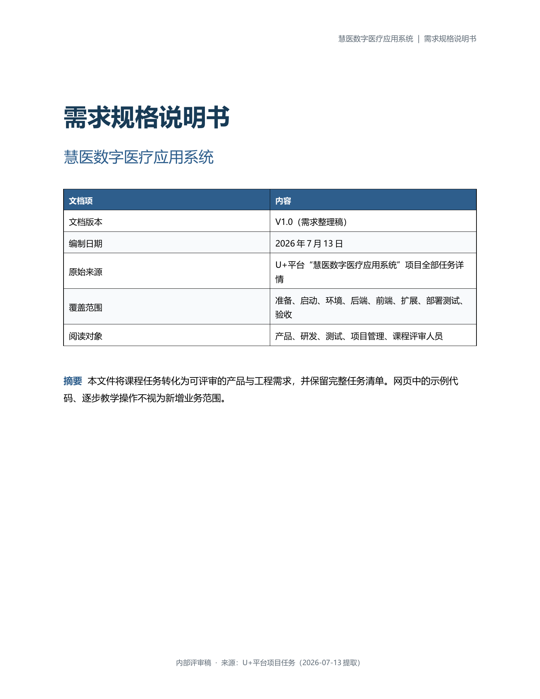
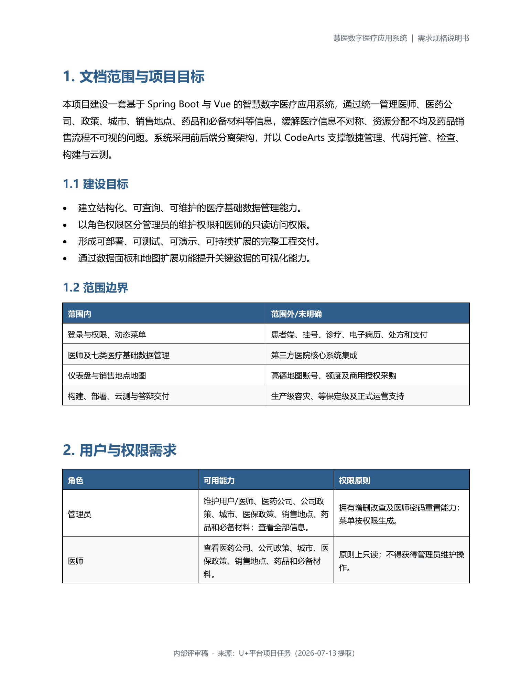
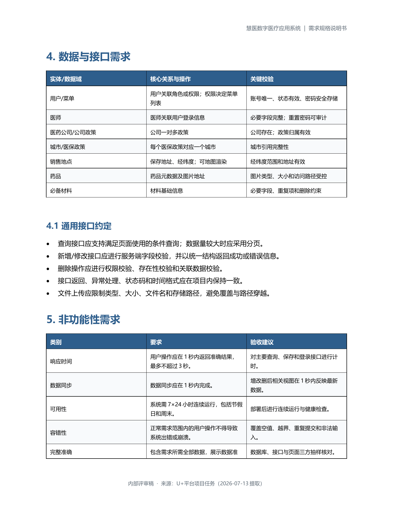
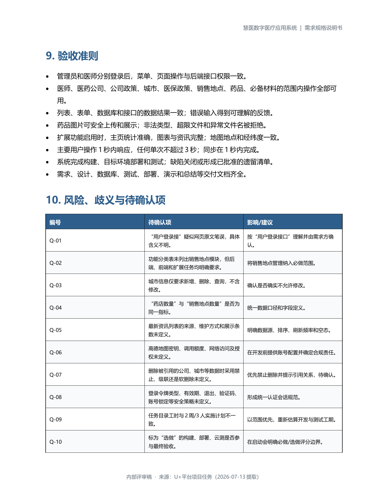

# 需求基线与追踪矩阵

## 1. 需求来源

本实现以以下材料为准：

1. `慧医数字医疗应用系统_需求规格说明书.docx`，共 12 页，版本 V1.0。
2. `需求/` 中 10 段功能演示视频。
3. 现有 Vue 2 前端的页面、Vuex、API 调用和动态路由代码。
4. `sql/medical.sql` 的 17 张原始表和种子数据。

## 2. 范围与角色

系统角色：

- 管理员：维护医生、公司、公司政策、城市、医保政策、销售地点、药品和必备材料；查看全部信息；重置医生密码。
- 医生：只读查看公司、公司政策、城市、医保政策、销售地点、药品和必备材料，不获得维护入口。

范围外：患者端、挂号、诊疗、电子病历、处方、支付和第三方医院核心系统集成。

## 3. 功能需求

| 编号 | 需求 | 后端/前端交付 | 验收方式 |
|---|---|---|---|
| AUTH-01 | 用户登录与权限鉴定 | BCrypt、Spring Security、Redis Token | 正确/错误密码、禁用账号、无 Token 测试 |
| AUTH-02 | 动态菜单与路由 | `/api/permissions` 返回权限树 | 管理员/医生菜单截图与越权测试 |
| AUTH-03 | 密码与数据安全 | 不存明文、服务端鉴权、重置审计 | DB 抽查、API 权限矩阵 |
| FR-DOC | 医生管理 | 查询、新增、修改、删除、重置密码 | 事务一致性、重复手机号、密码测试 |
| FR-COM | 医药公司管理 | 分页/全量查询和 CRUD | 接口与页面联调 |
| FR-CPP | 公司政策管理 | 公司关联、分页查询和 CRUD | 无效公司拒绝、嵌套返回 |
| FR-CITY | 城市管理 | 查询、新增、删除 | 区域编码和引用校验 |
| FR-MIP | 医保政策管理 | 城市关联、组合查询和 CRUD | 城市嵌套返回、引用校验 |
| FR-SALE | 销售地点管理 | 查询和 CRUD，增加地址/经纬度 | 坐标范围、地图/坐标展示 |
| FR-DRUG | 药品管理 | CRUD、药店多选、图片上传 | 关系事务、图片安全测试 |
| FR-MAT | 必备材料管理 | 分页查询和 CRUD | 管理员写、医生只读 |
| EXT-01 | 首页数据面板 | 数量、医生职称/诊治类型、资讯 | `/api/dashboard` 与首页截图 |
| EXT-02 | 销售地点地图 | 地址、经纬度和坐标展示 | 增改后保存并刷新 |

## 4. 数据与接口约定

前端兼容协议：

- API 前缀 `/api`。
- 响应统一为 `{code,message,data}`。
- 成功码 `20000`；手机号重复 `10001`；Token 失效 `10006`。
- 登录提交为 `application/x-www-form-urlencoded`。
- Token 放在 `Authorization`；兼容现有裸 Token，并同时支持 Bearer 格式。
- 分页对象包含 `list,total,pages,pageNum,pageSize`。
- 为兼容既有 Vue，保留不同模块的分页键名。

## 5. 验收矩阵

| 验收域 | 主要检查 |
|---|---|
| 构建 | 前端 `npm run build`、后端 `mvn clean test package` 成功 |
| 登录 | 管理员登录成功、错误密码失败、Token 存入 Redis 且带 TTL |
| 权限 | 医生不能调用任何写接口，篡改 roleName 不提升权限 |
| 数据 | 列表、接口、数据库三方一致；新增后立即可查 |
| 上传 | 仅 JPG/PNG、最大 2 MB、真实图片校验、随机文件名 |
| 性能 | 主要操作目标 1 秒内，单次不超过 3 秒 |
| 部署 | JAR 可启动、健康检查为 UP、前端同源代理可用 |
| 文档 | 需求、设计、数据库、接口测试、部署、验收材料齐全 |

## 6. 需求歧义处理

- 城市修改：原始前端仅提供新增和删除，后端保持兼容，不无故增加前端维护负担。
- 删除策略：被公司政策/医保政策引用的公司或城市默认拒绝删除，不静默级联。
- 医生重置密码：后端生成随机临时密码并只在本次响应返回，同时写审计记录。
- 地图：未提供高德密钥，交付地址和经纬度的可用坐标展示；部署方提供密钥后可接入地图 SDK。
- Java 兼容性：按文档锁定 Spring Boot 2.5.3，并覆盖 Spring Framework 5.3.10，通过 JDK 17 的实际构建、测试和启动作为交付门禁。

