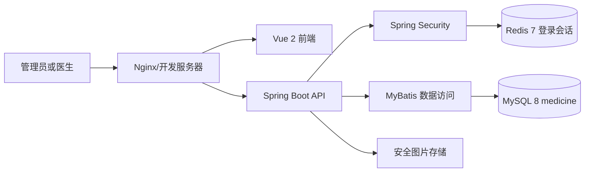
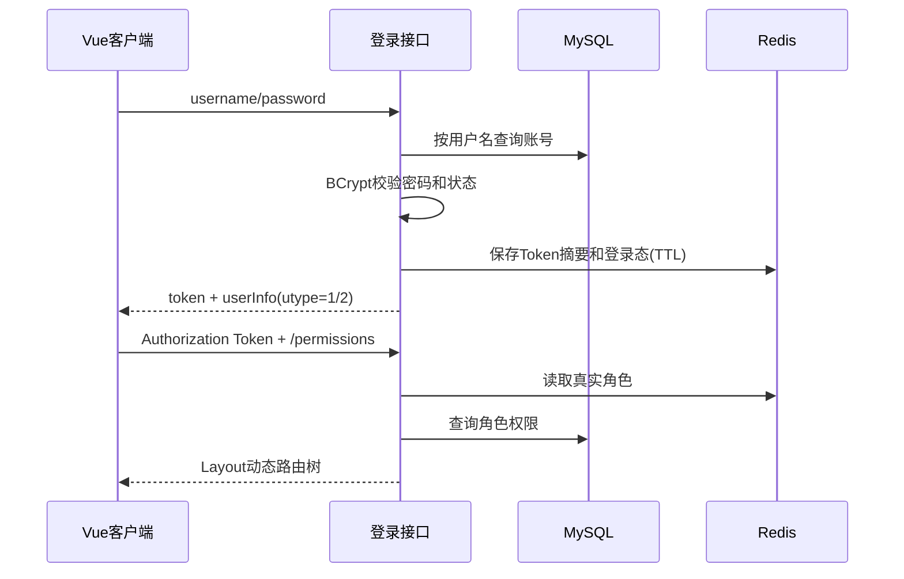
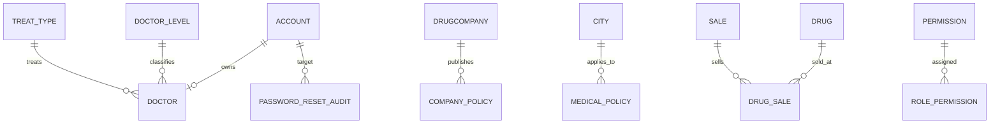

# 概要设计与详细设计

## 1. 总体架构



采用前后端分离架构。生产环境由 Nginx 同源发布前端，并代理 `/api` 到后端，避免浏览器跨域和 `localhost` 硬编码问题。

## 2. 后端分层

```text
controller  HTTP 契约、参数校验、角色注解
    ↓
service     业务规则、事务、引用校验、分页组装
    ↓
mapper      MyBatis 参数化 SQL
    ↓
MySQL       medicine schema
```

公共横切能力：

- `common`：统一响应、分页、业务异常和全局异常处理。
- `security`：Token 生成/摘要、Redis 会话、请求过滤和 401/403 处理。
- `config`：Spring Security、CORS、MyBatis 与上传配置。
- `auth`：登录、退出和动态权限菜单。
- `business`：八类业务模块、仪表盘与上传。

## 3. 登录与授权时序



安全原则：

- 不相信客户端提交的 `roleName` 或 localStorage 中的角色。
- Redis key 使用 Token 的 SHA-256，不把原始 Token 作为 key。
- 管理员写接口使用服务端方法级鉴权；医生只有业务 GET。
- Token 过期或退出后返回前端可识别的 `10006`。

## 4. 数据模型



迁移后核心关系由数据库外键和服务层双重校验。原始脏关系先归档到 `data_quality_issue` 再清理，过程见数据库实施记录。

## 5. 事务边界

- 医生新增：账号唯一性检查、账号插入、医生插入在同一事务。
- 医生删除：先校验引用，再删除医生和账号；失败整体回滚。
- 密码重置：更新 BCrypt 密码、失效旧 Token、写审计在同一事务。
- 药品新增/修改：药品与 `drug_sale` 关系在同一事务。
- 公司/城市删除：存在政策引用时返回冲突，不级联误删。

## 6. 上传设计

1. 最大 2 MB。
2. 扩展名与 Content-Type 仅允许 JPEG/PNG。
3. 使用图片解码进一步校验真实文件内容。
4. 服务端生成 UUID 文件名，拒绝用户路径。
5. 上传目录通过 `UPLOAD_DIR` 配置，生产推荐 `/opt/medicine/uploads`。
6. 返回 URL 通过公开基址配置生成，不写死 localhost。

## 7. 配置与凭据

- 仓库仅提交环境变量占位和 `.example` 文件。
- 本地测试通过进程环境变量注入数据库和 Redis 密码。
- 服务器使用权限为 `0600` 的 `/etc/medicine/medicine-backend.env`。
- 正式环境建议创建 `medicine_app` 最小权限账号；本次按用户提供账号完成远程联调。
