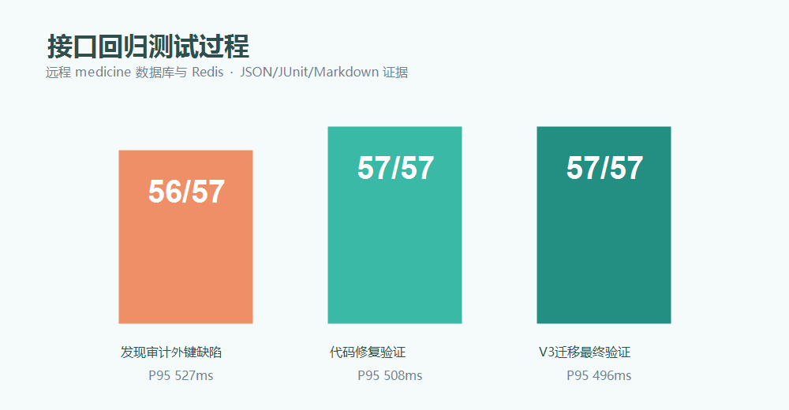

# 接口参考与测试报告

## 1. 接口资产

- 自动回归：`api-tests/run_api_tests.py`
- Postman Collection：`api-tests/postman/medicine-api.postman_collection.json`
- Postman 无密钥环境：`api-tests/postman/medicine-local.postman_environment.example.json`
- JUnit/JSON/Markdown 证据：`process-docs/evidence/api/`

后端共发布 43 条映射、42 个唯一方法/路径组合；Postman 共 11 个目录、59 个请求，路由覆盖缺失为 0。

## 2. 认证和公共接口

| 方法 | 路径 | 权限 | 说明 |
|---|---|---|---|
| POST | `/api/login` | 公开 | 表单/JSON 登录，返回 Token 和用户信息 |
| GET | `/api/permissions` | 已登录 | 按真实会话角色返回动态菜单 |
| POST | `/api/logout` | 已登录 | 删除 Redis 会话 |
| GET | `/api/dashboard` | 管理员/医生 | 八类数量、医生分布、资讯 |
| GET | `/actuator/health` | 公开 | MySQL、Redis 和应用健康检查 |

## 3. 业务接口

| 模块 | 查询 | 写操作 |
|---|---|---|
| 城市 | `GET /api/citys/{pn}/{size}`、`GET /api/citys` | `POST /api/citys`、`DELETE /api/citys/{id}` |
| 公司 | `GET /api/companys/{pn}/{size}`、`GET /api/companys` | `POST /api/companys`、`PUT/DELETE /api/companys/{id}` |
| 销售地点 | `GET /api/sales/{pn}/{size}`、`GET /api/sales` | `POST /api/sales`、`PUT/DELETE /api/sales/{id}` |
| 公司政策 | `GET /api/company_policys` | `POST /api/company_policys`、`PUT/DELETE /api/company_policys/{id}` |
| 医保政策 | `GET /api/medical_policys` | `POST /api/medical_policys`、`PUT/DELETE /api/medical_policys/{id}` |
| 医生 | `GET /api/doctors`、`GET /api/doctors/info` | `POST /api/doctors`、`PUT/DELETE /api/doctors/{id}`、`PUT /api/doctors/reset/{accountId}` |
| 药品 | `GET /api/drugs/{pn}/{size}` | `POST /api/drugs`、`PUT/DELETE /api/drugs/{id}` |
| 必备材料 | `GET /api/materials` | `POST /api/materials`、`PUT/DELETE /api/materials/{id}` |
| 图片 | `GET /image/{name}` | `POST /api/base/upload` |

医生允许业务 GET，但所有 POST/PUT/DELETE 均由服务端 `@PreAuthorize` 拒绝。

## 4. 自动回归结果

Docker Compose 部署后的最终报告：`evidence/api/api-test-20260713T065014Z.md`，目标为同源入口 `http://localhost:9092`。

| 指标 | 最终结果 |
|---|---:|
| 用例总数 | 57 |
| 通过 | 57 |
| 失败 | 0 |
| 跳过 | 0 |
| 平均响应时间 | 309.9 ms |
| P95 | 550 ms |
| 最大响应时间 | 639 ms |

全部请求低于需求的 1 秒目标，也低于 3 秒硬上限。

覆盖范围：

- 健康检查、正确/错误/缺参登录。
- 无 Token、伪造 Token、退出后 Token 失效。
- 管理员菜单、仪表盘、医生只读和医生越权写入。
- 八类业务的查询、新增、修改、删除和嵌套响应。
- 重复城市、重复手机号。
- 医生新增、修改、登录、重置、旧密码失效和删除。
- 合法 PNG 上传和伪造图片拒绝。
- 自动逆序清理临时业务数据。

## 5. 缺陷闭环

第一轮结果为 56/57：

- 失败用例：医生先重置密码再删除。
- 根因：`password_reset_audit.account_id` 使用 `ON DELETE RESTRICT`，账号删除被数据库拒绝。
- 代码/数据库修复：新增 V3 迁移，将审计关系改为账号生命周期级联；补 `DoctorServiceTest`。
- 修复后 Maven 测试从 7 项增加到 8 项并全部通过。
- 修复后的两轮完整 API 回归均达到 57/57；端口调整和 Docker Compose 部署后分别再次回归 57/57。
- 最终确认远程数据库无临时账号、医生或测试审计残留。

失败证据保留为 `evidence/api/api-test-20260713T034308Z.*`，V3 修复证据为 `evidence/api/api-test-20260713T035159Z.*`，端口调整证据为 `evidence/api/api-test-20260713T042628Z.*`，Docker 最终通过证据为 `evidence/api/api-test-20260713T065014Z.*`。

## 6. 凭据与报告安全

- 本机进程模式从私有环境文件注入密码；Docker 模式通过只读 Secrets 文件注入。
- 报告不记录密码、Authorization 或完整 Token。
- Postman 示例环境不含数据库、Redis 或业务账号密码。
- 上传测试仅在本地 `.work/runtime/uploads` 留下测试图片，不进入 Git。
