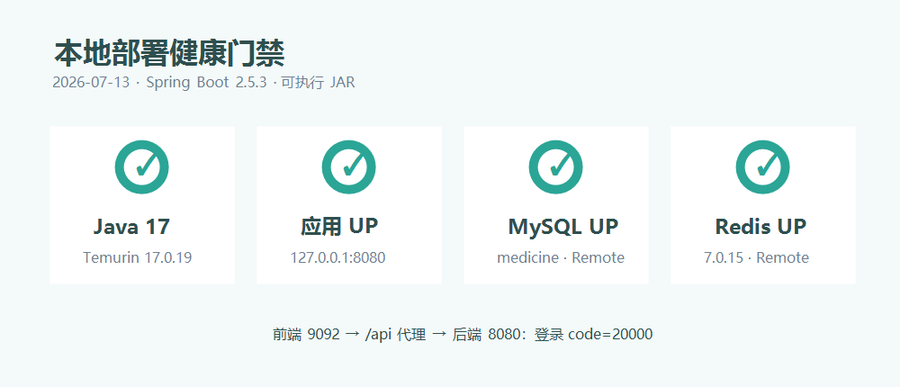
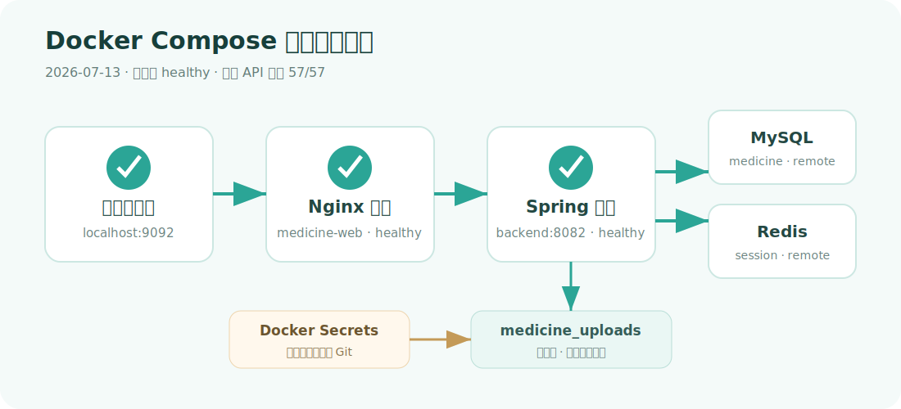

# 构建与部署记录

## 1. 构建结果

| 产物 | 命令 | 结果 |
|---|---|---|
| 前端 | `npm run build` | 成功，最终构建哈希 `5791661e6b59f2ac` |
| 后端测试 | `mvn clean test` | 8/8 通过 |
| 后端打包 | `mvn package` | 成功 |
| 后端 JAR | `medical-backend-1.0.0.jar` | 38,131,660 bytes |

Spring Boot 固定为 2.5.3，Spring Framework 实际解析为 5.3.10，编译目标为 Java 17。

## 2. JDK 17 实际运行门禁

本机原默认 JDK 为 21。为满足需求，不仅设置 `release=17`，还下载了被 Git 忽略的便携式 Temurin JDK 17，并用它启动最终 JAR：

```text
openjdk version "17.0.19"
Starting MedicalBackendApplication v1.0.0 using Java 17.0.19
Tomcat started on port(s): 8080
```



Actuator 最终状态：

```json
{
  "status": "UP",
  "components": {
    "db": {"status": "UP", "database": "MySQL"},
    "redis": {"status": "UP", "version": "7.0.15"},
    "diskSpace": {"status": "UP"},
    "ping": {"status": "UP"}
  }
}
```

## 3. 前后端联通

- 前端开发服务：[http://localhost:9092/](http://localhost:9092/)
- 后端健康检查：[http://localhost:8082/actuator/health](http://localhost:8082/actuator/health)
- 前端 `/api` 代理登录返回 `code=20000`。
- JDK 17 下登录、权限、仪表盘和退出均返回 `20000`。
- 前端开发服务 HTTP 200，生产 `dist/index.html` 存在。

当前已切换为 Docker Compose 运行，页面仍使用 `9092`，后端 `8082` 仅在 Docker 网络内暴露。

## 4. openEuler/Linux 部署包

`deploy/` 已提供：

- `systemd/medicine-backend.service`
- `nginx/medicine.conf`
- `env/medicine-backend.env.example`
- `scripts/start-local.ps1`
- `scripts/verify-deployment.ps1`
- `README.md`

Docker 拓扑：BusyBox 发布前端静态文件，浏览器直接访问后端 `8082` API 与 `/image`；后端以非 root 用户运行，密码来自 Docker Secrets。

## 5. 部署验证与回滚

部署后验证：

1. `systemctl status medicine-backend`。
2. `curl http://localhost:8082/actuator/health`。
3. 管理员登录、菜单、仪表盘和八类 GET。
4. 医生写接口越权检查。
5. 后端 `/api` 和 `/image` 通过发布端口直接访问，上传目录由命名卷持久化。

回滚：

1. 保留上一个 JAR 和前端目录。
2. 停止服务，替换为上一个 JAR/前端版本。
3. 仅当代码回滚要求时执行对应数据库回滚；原始 SQL 绝不可在有业务数据的 schema 重跑。
4. 重启并重复健康检查与登录烟测。

## 6. 当前部署边界

本次已完成当前 Windows 环境的 JDK 17 部署运行，并连接远程 MySQL/Redis。目标 IP 的 8080 已存在另一个受 Spring Security 保护的服务，且用户未提供操作系统 SSH 账号，因此没有覆盖远程主机现有服务；已交付可直接用于 openEuler 的 Nginx/systemd 配置。

## 7. 本地端口调整记录（2026-07-13）

按验收要求，后端默认端口已由 `8080` 调整为 `8082`，前端开发代理、接口测试、Postman 环境、Nginx upstream、启动与验证脚本均已同步。上方 `Tomcat started on port(s): 8080` 是调整前的历史启动证据，保留不改写。

本机 QQ 占用了 IPv4 `0.0.0.0:8082`，本次后端通过 `SERVER_ADDRESS=::1` 安全绑定到 IPv6 本地回环地址，未结束或干扰 QQ；浏览器与前端代理统一使用 `localhost:8082`。

## 8. Docker Compose 部署记录（2026-07-13）



根目录 `compose.yaml` 提供前后端一键构建和启动：

```powershell
docker compose up -d --build
```

- `medicine-backend:1.0.0`：Temurin JRE 17.0.19，非 root UID/GID 10001，内部端口 8082，只读根文件系统，默认 768 MB/1.5 CPU/PID 256 上限。
- `medicine-web:1.0.0`：BusyBox 静态文件服务，对外发布 9092；API 基址通过 `MEDICINE_API_BASE_URL` 构建参数配置。
- MySQL/Redis 密码通过 `.work/private/docker/*.txt` 以 Docker Secrets 只读挂载，不进入镜像、Compose 明文或容器环境。
- 上传文件保存在命名卷 `medicine_uploads`；执行 `docker compose down` 后重建容器，测试图片仍返回 HTTP 200。
- 两个容器均为 `healthy`；同源健康检查 HTTP 200；Docker 入口黑盒回归 57/57。
- Web 默认仅绑定 `127.0.0.1:9092`；JSON 日志按 10 MB × 3 文件轮转，后端停止宽限期为 40 秒。

完整命令和密码轮换方式见 `deploy/docker/README.md`，详细实测证据见 `evidence/deployment/docker-compose-20260713.md`。
